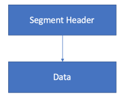

{
  "date": "2019-12-12",
  "keywords": [
"JT",
"fayl",
"uzadılması",
"format",
"3D fbx",
""
],
  "author": {
    "display_name": "Kashif Iqbal"
},
  "draft": "false",
  "toc": true,
  "description": "JT fayl formatı və JT fayllarını yarada və aça bilən API-lər haqqında məlumat əldə edin.",
  "title": "JT - Yupiter Tessellation Fayl Formatı",
  "linktitle": "JT",
  "menu": {
    "docs": {
      "parent": "3d",
      "identifier": "3d-j-azt"
}
},
  "lastmod": "2019-09-10"
}

## JT faylı nədir?

**JT** (Jupiter Tessellation) Siemens PLM Software tərəfindən hazırlanmış səmərəli, sənayeyə yönəlmiş və çevik ISO standartlı 3D məlumat formatıdır. Aerokosmik, avtomobil sənayesi və Ağır Avadanlıqların mexaniki CAD domenləri JT-dən ən aparıcı 3D vizuallaşdırma formatı kimi istifadə edir.

JT formatı CAD-ə xas olan atributları və qovşaqları dəstəkləyən səhnə qrafikidir. Faset məlumatlarını (üçbucaqlar) saxlamaq üçün mürəkkəb sıxılma üsullarından istifadə olunur. Bu format vizual atributları, məhsul və istehsal məlumatlarını (PMI) və metaməlumatları dəstəkləmək üçün strukturlaşdırılmışdır. Məzmunun asinxron axını üçün yaxşı dəstək var. Ağır mexaniki sənayedə peşəkarlar mürəkkəb malların həndəsəsini yoxlamaq üçün CAD həlləri və məhsulun həyat dövrünün idarə edilməsi (PLM) proqram proqramlarında JT faylından istifadə edirlər.

As JT supports nearly all important 3D CAD formats its assembly can deal with a variety of combination which is known as "multi-CAD". This multi-CAD assembly is always well managed and up-to-date because synchronization among native CAD product description files with their associated JT files takes place automatically. JT files are originally lightweight, so considered to be suitable for internet collaborations. Companies Collaborate through sending 3D visualizations over the media much more easily as compared to “heavy" original CAD files. In addition, JT files ensures many security feature that make intellectual property sharing more secure.

## JT Fayl Formatının Qısa Tarixi

Engineering Animation, Inc. və Hewlett Packard bu formatı Direct Model alət dəsti kimi inkişaf etdirən JT-nin orijinal dizaynerləri idi. EAI UGS Corp. tərəfindən alındıqdan sonra JT UGS paketinin bir hissəsi oldu. 2007-ci ilin əvvəlində UGS JT-ni əsas 3D formatı kimi elan etdi. Elə həmin il Siemens AG UGS satın aldı və Siemens PLM Software oldu. Siemens ümumi qarşılıqlı fəaliyyət formatı və məlumat arxiv formatı kimi JT-dən istifadə edir. 2009-cu ildə ISO JT spesifikasiyasını ISO Public Available Specification (PAS) kimi dərc etmək üçün qəbul etdi. 2010-cu ilin ortalarında ProSTEP iViP sənaye səviyyəsində JT və STEP AP 242 XML-in verilənlərdə maksimum üstünlük əldə etmək üçün birlikdə istifadə oluna biləcəyini elan etdi. mübadilə ssenariləri. 2012-ci ildə JT rəsmi olaraq ISO standartlı (ISO 14306:2012 (ISO JT V1)) 3D vizuallaşdırma formatı kimi elan edilmişdir.

## JT Fayl Format ##

JT formatındakı bütün obyektlər obyekt identifikatoru vasitəsilə təmsil olunur və obyektlər arasında istinadlar istinad edilən obyektin identifikatoru vasitəsilə idarə olunur. Bu obyekt istinadlarının bütövlüyü göstəricilər sönən/swizzling vasitəsilə təmin edilə bilər.

JT faylı bir sıra bloklar kimi təşkil edilir və Başlıq bloku həmişə fayldakı məlumatların ilk blokudur. Bir sıra məlumat seqmenti və TOC seqmenti dərhal başlıq blokunu izləyir. Bir Məlumat seqmenti (6 LSG Seqmenti) həmişə mövcud olan istinad uyğun JT faylına malikdir. TOC Seqmenti həmin faylın bütün digər Məlumat Seqmentlərinin yer məlumatlarını ehtiva edir.

### Fayl başlığı ###

Fayl başlığı JT faylının məlumat iyerarxiyasında ilk blokdur. Versiya məlumatı və TOC yeri məlumatı yükləyicilərin fayl oxunmasını asanlaşdıran başlığa əlavə olunur. Fayl başlığının məzmunu aşağıdakı kimi yerləşdirilir.

### TOC Seqmenti ###

TOC Seqmenti fayl daxilində mövcud olmalıdır və bütün digər məlumat seqmentlərinin identifikasiyası və yeri məlumatını ehtiva edir. TOC Seqmentinin faktiki yeri fayl başlığının TOC Ofset sahəsi ilə müəyyən edilir. Hər bir fərdi şəkildə ünvanlana bilən Məlumat Seqmenti TOC seqmentində TOC girişi ilə təmsil olunur.

### Məlumat Seqmenti ###

JT faylı Data Seqmentində saxlanılan bütün məlumatları müəyyən edir. Bəzi Data Seqmentləri seqmentdə qalan məlumatın bütün baytlarını sıxışdıra bilər. Məlumat seqmentləri aşağıdakı quruluşa malikdir:

Aşağıdakı cədvəl müxtəlif növ məlumat seqmentlərini təsvir edir:

|Ad|Təsvir
---|---|
|LSG seqmenti|LSG (istiqamətləndirilmiş asiklik qrafik strukturu) yaratmaq üçün yönəldilmiş istinadlar vasitəsilə əlaqələndirilmiş obyektlər toplusundan ibarətdir
|Shape LOD seqmenti|həndəsi fiqurlar (məsələn, təpələr, normallar, çoxbucaqlılar və s.) üçün müəyyənedici məlumatları ehtiva edir.
|JT B-Rep Seqmenti|JT B-Rep formatında fərdi hissə üçün dəqiq həndəsi sərhədi təmsil etmək üçün verilənlər üçün elementə malik olmaq.
|XT B-Rep seqmenti|Sərhəd təmsili formatında fərdi hissə üçün dəqiq həndəsi sərhədi təmsil etmək üçün verilənlər üçün elementə malik olmaq
|Wireframe seqmenti|Məlumatlar bu seqmentdə olan element tərəfindən müəyyən edilən müəyyən bir hissə üçün dəqiq 3D tel kafesini təmsil edir.
|Meta Data seqmenti|Metaməlumatları fərqli ünvanlı seqmentlərdə saxlamağa imkan verir.
|JT ULP seqmenti|JT ULP formatında fərdi hissə üçün yarı dəqiq həndəsi sərhədi təmsil edən verilənlər üçün elementə malik olmaq.
|JT LWPA seqmenti|Müəyyən bir hissə üçün analitik məlumatları təyin edən elementi ehtiva edir. LWPA analitik səthlər kolleksiyasını hissənin b-rep tərifində əhatə edir.

## Sıxılma ##

3D modellərin ötürülməsi və saxlanması tələbləri daha tələbkardır, ona görə də JT faylları sıxılmadan faydalana bilər. JT məlumat modeli fərqli sıxılma texnikasından istifadə edərək müxtəlif fayllardan ibarət ola bilər, lakin sıxılma prosesi JT məlumat istifadəçisi üçün şəffafdır.

İndiyə qədər JT Open Toolbar (standart olaraq) və qabaqcıl sıxılma, JT faylları tərəfindən istifadə edilən iki sıxılma texnikasıdır. JT Açıq Alətlər dəsti asan, itkisiz sıxılma alqoritmindən istifadə edir, qabaqcıl sıxılma isə daha zərif, domenə xas sıxılma texnikasından istifadə edir və itkili həndəsə sıxılmasına səbəb olur. Müştəri proqramları standart sıxılmadan istifadə etmək əvəzinə qabaqcıl sıxılmaya üstünlük verir, çünki inkişaf etmiş sıxılma kifayət qədər yüksək sıxılma nisbətləri verir. Adi JT fayla baxmaq proqramları ilə geriyə uyğunluq standart sıxılma təmin etməklə təmin edilir. Sıxılma forması mətn redaktorundan istifadə edərək JT faylı açıldıqda və ASCII başlıq məlumatı daxilində görünən JT fayl formatı versiyası ilə uyğun olmalıdır.

## İstinadlar ##

* [JT Fayl Format Referansı](https://www.plm.automation.siemens.com/en_us/Images/JT-v10-file-format-reference-rev-B_tcm1023-233786.pdf)

* [JT (vizuallaşdırma formatı)](https://en.wikipedia.org/wiki/JT_(visualization_format)#Data_model)

