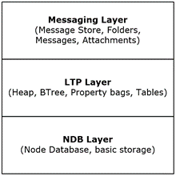
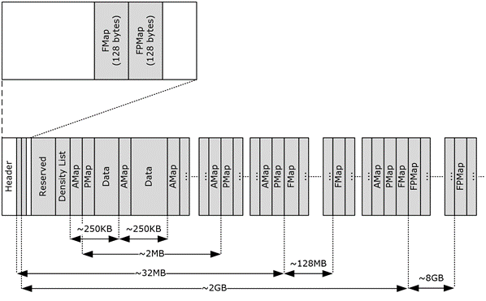

{
  "date": "2019-10-11",
  "author": {
    "display_name": "Kashif Iqbal"
},
  "draft": "false",
  "toc": true,
  "title": "PST - Outlook Şəxsi Məlumat Mağazası Fayl Formatı",
  "description": "PST faylları yarada və aça bilən PST fayl formatı və API-lər haqqında məlumat əldə edin.",
  "linktitle": "PST",
  "menu": {
    "docs": {
      "parent": "email",
      "identifier": "email-ps-azt"
}
},
  "lastmod": "2019-09-10"
}

## PST faylı nədir?

.pst uzantılı fayllar müxtəlif istifadəçi məlumatlarını saxlayan Outlook Şəxsi Yaddaş Fayllarını (həmçinin Şəxsi Yaddaş Cədvəli adlanır) təmsil edir. İstifadəçi məlumatı e-poçtlar, təqvim elementləri, qeydlər, kontaktlar və bir sıra digər fayl formatları daxil olmaqla müxtəlif növ qovluqlarda saxlanılır. PST faylları sonradan yüklənə və müxtəlif proqramlarda baxıla bilən e-poçt məlumatlarının oflayn arxivləşdirilməsi üçün istifadə olunur.

## PST Fayl Formatının Xüsusiyyətləri

PST Fayl formatı [specifications](https://learn.microsoft.com/en-us/openspecs/office_file_formats/ms-pst/141923d5-15ab-4ef1-a524-6dce75aae546) Microsoft-dan Açıq Spesifikasiya Promise vasitəsilə pulsuz və geri alınmaz pulsuz patent lisenziyası kimi əldə edilə bilər.

### PST Formatlarının Növü

PST fayl formatları fayl növünün kodlaşdırılmasına əsasən iki növə bölünür. ANSI kodlu PST faylları köhnə fayl formatlarıdır və yalnız Outlook 2002 və əvvəlki versiyalar tərəfindən dəstəklənir. Belə faylların maksimum ölçüsü həddi 2 GB (2^^31^^ Bayt) təşkil edir və Unicode-u dəstəkləmir. Unicode kodlaşdırmasına əsaslanan daha müasir fayl formatı növü fayl ölçüsü məhdudiyyətini aradan qaldırır və maksimum 50 GB məlumat ölçüsünə çata bilər.

### PST Fayl Formatının Məntiqi Təşkili

PST fayl formatının əsasında verilənlərin çeşidlənməsini saxlayan və loqarifmik vaxtda axtarışlara, ardıcıl girişlərə, əlavələrə, silmələrə və s. imkan verən B-Tree yerləşir. PST faylının ümumi strukturu üç qatda təşkil edilmişdir.

`Node Database (NDB) Layer` - Node verilənlər bazası təbəqəsi PST faylının aşağı səviyyəsində yerləşir və qovşaqların verilənlər bazasını ehtiva edir. Bu qovşaqlar əslində PST fayl formatının aşağı səviyyəli saxlama vasitələrini təmsil edir. NDB təbəqəsi başlıqdan, fayl yerləşdirmə məlumatından, bloklardan və saxlama baxımından BTreelərdən (Node BTree və Block BTree) ibarətdir. NDB Layerinin qovşaqları və blokları Node istinadının dörd xüsusiyyətindən biri olan Data BID vasitəsilə əlaqələndirilir, yəni NID (Node ID), Ana NID, Data BID (Block BID) və SubNode BID.

`Siyahılar, Cədvəllər və Xüsusiyyətlər Layeri -` LTP qatı NDB-nin üstündə daha yüksək səviyyəli anlayışların məntiqi başa düşülməsini təmin edir. Digər elementlərlə yanaşı, LTP səviyyəsi əsasən Mülkiyyət Kontekstindən (PC) və Cədvəl Kontekstindən (TC) ibarətdir. PC xassələr toplusudur, TC isə xassələrin mövcudluğuna qarşı ikiölçülü matrisləri təmsil edir. Fərdi kompüterlərin və TC-lərin səmərəli tətbiqi, LTP səviyyəsi NDB Node üzərində aşağıdakı iki növ məlumat strukturundan istifadə edir:

* Heap On Node (HN) - node məlumat axınının kiçik, dəyişən ölçülü fraqmentlərə bölünməsinə imkan verir.

* BTree on Heap (BTH) - BTH yuxarıda təsvir edilən məlumat kompüterləri vasitəsilə axtarışın rahat və praktik yolunu təmin edir, BTH kimi həyata keçirilir və buna görə də HN strukturunun daxilində tikilməklə həyata keçirilir.

`Mesajlaşma Layeri -` PST faylları ilə işləmək üçün daha yüksək səviyyəli qaydalar və biznes məntiqi bu təbəqədə həyata keçirilir. Bu təbəqənin məntiqi nəticəsi Qovluq obyektləri, Mesaj obyektləri, Qoşma obyektləri və LTP və NDB qatlarını birləşdirməklə mümkün olan Xüsusiyyətlər kimi nəticələnir. PST məzmununu dəyişdirərkən riayət edilməli olan qaydalar və tələblər də bu təbəqədə müəyyən edilmişdir.

### PST Fayl Formatının Fiziki Təşkili

PST faylının yüksək səviyyədə fayl təşkili aşağıdakı şəkildə göstərildiyi kimidir. Bu, PST faylının məntiqi elementlərindən fərqli anlayışların sadəcə icmalıdır.

#### PST Başlıq Məlumatı

PST faylının HEADER strukturu faylın ən əvvəlində 0 ofsetdə yerləşir. O, yuxarıda təsvir edilmiş NDB Layer məlumat strukturlarına daxil olmaq üçün PST faylı və ROOT məlumatı haqqında metadata məlumatını ehtiva edir. HEADER strukturu PST Fayl Formatının Unicode və ANSI versiyaları üçün fərqlənir.

Başlıq baytlarla təmsil olunan 4 baytlıq sehrli söz **!BDN** ilə başlayır (0x21, 0x42, 0x44, 0x4E). Digər 2 baytlıq sehrli nömrə, **SM** (0x53, 0x4D), faylın başlanğıcından 8 ofsetində yerləşir. Versiya məlumatı (ANSI və ya Unicode) faylın başlanğıcından 10 ofsetdədir. Hex dəyəri (0x17) Unicode PST faylını təyin edir, 0x0E və ya 0x0F isə ANSI fayl formatını təmsil edir.

|Sahə|Təsvir
---|---|
|dwMagic (4 bayt)| { 0x21, 0x42, 0x44, 0x4E } (!BDN) OLMALIDIR
|dwCRCPartial (4 bayt)|wMagicClient-dən (0ffset 0x0008) başlayan 471 bayt məlumatın 32 bitlik CRC dəyəri
|wMagicClient (2 bayt)| { 0x53, 0x4D } olmalıdır.
|wVer (2 bayt)|Fayl formatı versiyası. Fayl ANSI PST faylıdırsa, bu dəyər 14 və ya 15, fayl Unicode PST faylıdırsa, 23 olmalıdır.
|wVerClient   (2 bytes)|Client file format version. The version that corresponds to the format described in this document is 19. Bu sənədə əsaslanan yeni PST faylının yaradıcıları bu dəyəri 19-a endirməlidirlər.
|bPlatformCreate (1 bayt)|Bu dəyər 0x01 olaraq təyin olunmalıdır.
|bPlatformAccess (1 bayt)|Bu dəyər 0x01-ə təyin olunmalıdır.
|dwReserved (8 bayt)|
|bidUnused (yalnız 8 bayt Unicode)|Unicode PST fayl formatı yaradılarkən istifadə olunmamış doldurma əlavə edildi.
|bidNextP (Unicode: 8 bayt; ANSI: 4 bayt)|Növbəti səhifə BID. Səhifələrdə bidIndex dəyərlərinin bölüşdürülməsi üçün xüsusi sayğac var. Səhifələr üçün BID-lər üçün bidIndex dəyəri bu sayğacdan ayrılır.
|bidNextB     (4 bytes ANSI only): |Next BID. This value is the monotonic counter that indicates the BID to be assigned for the next allocated block. BID values advance in increments of 4. Ətraflı məlumat üçün 2.2.2.2 bölməsinə baxın.
|dwUnique (4 bayt)|Bu, PST faylının HEADER strukturu dəyişdirildikdə hər dəfə dəyişdirilən monoton artan dəyərdir. Bu dəyərin funksiyası unikal dəyər təmin etmək və hər başlıq modifikasiyasından sonra HEADER CRC-lərin fərqli olmasını təmin etməkdir.
|rgnid[] (128 bayt)|Hər biri 32 mümkün NID_TYPE-dən birinə uyğun gələn 32 NID-dən ibarət sabit massiv (NID_TYPE, NID_TYPE_NORMAL_FOLDER, NID_TYPE_SEARCH_FOLDER, NID_TYPE_NORMAL_MESSAGE_MESSAGE_ASNID)
|qwUnused (8 bayt)|İstifadə olunmayan yer; Sıfıra təyin olunmalıdır. Yalnız Unicode PST fayl formatı.
|kök (Unicode: 72 bayt; ANSI: 40 bayt)|ROOT strukturu (bölmə 2.2.2.5).
|dwAlign (4 bayt)|İstifadə olunmamış düzləşdirmə baytları; Sıfıra təyin olunmalıdır. Yalnız Unicode PST fayl formatı.
|rgbFM (128 bayt)|FMap köhnəlmişdir. Bu artıq istifadə edilmir və 0xFF ilə doldurulmalıdır. Oxucular bu baytların dəyərinə məhəl qoymamalıdırlar.
|rgbFP (128 bayt)|Köhnəlmiş FPMap. Bu artıq istifadə edilmir və 0xFF ilə doldurulmalıdır. Oxucular bu baytların dəyərinə məhəl qoymamalıdırlar.
|bSentinel (1 bayt)| 0x80-ə təyin olunmalıdır.
|bCryptMethod (1 bayt)|PST faylı daxilində verilənlərin necə kodlandığını göstərir. Əvvəlcədən müəyyən edilmiş dəyərlərdən (NDB_CRYPT_NONE, NDB_CRYPT_PERMUTE, NDB_CRYPT_CYCLIC) birinə təyin edilməlidir.
|rgbReserved (2 bayt)| Qorunur; Sıfıra təyin olunmalıdır.
|bidNextB (8 bayt)|Növbəti mövcud BID dəyərini göstərir. Yalnız Unicode PST fayl formatı.
|bidNextB     (Unicode ONLY: 8 bytes)|Next BID. This value is the monotonic counter that indicates the BID to be assigned for the next allocated block. BID values advance in increments of 4. Ətraflı məlumat üçün 2.2.2.2 bölməsinə baxın.
|dwCRCFull (4 bayt)|wMagicClient-dən bidNextB-ə qədər daxil olmaqla, 516 bayt məlumatın 32-bit CRC dəyəri. Yalnız Unicode PST fayl formatı.
|ullReserved (8 bayt)|Zorunludur; Sıfıra təyin olunmalıdır. Yalnız ANSI PST fayl formatı.
|dwReserved (4 bayt)|Reserved; Sıfıra təyin olunmalıdır. Yalnız ANSI PST fayl formatı.
|rgbReserved2 (3 bayt)|
|bReserved (1 bayt) |
|rgbReserved3 (32 bayt) |

### Məlumatların Mühafizəsi ###

Təhlükəsizlik üçün PST faylları parolla qoruna bilər ki, bu da yükləmə tətbiqindən ona baxılmadan əvvəl parol tətbiq etməsini tələb edir. PST faylına tətbiq edilən parol mesaj anbarında saxlanılır. Bununla belə, bu, güclü məlumat qorunması təmin etmir, çünki parol mövcud alətlərlə silinə bilər. Həmçinin, istifadəçi tərəfindən müəyyən edilmiş parol şifrə alqoritmlərinin kodlaşdırılması və deşifrə edilməsi üçün açarın bir hissəsi kimi istifadə edilmir. Beləliklə, icazəsiz şəxslər tərəfindən əldə edilə bilən məlumatların qorunmasının heç bir faydası yoxdur. Parolun orijinal sətirin CRC-32 hash kimi saxlanması onu kobud güc yanaşmasına qarşı məlumat təhlükəsizliyi üçün zəif metoda çevirir.

## İstinadlar ##

* [Outlook Şəxsi Qovluqları (.pst) Fayl Formatı](https://learn.microsoft.com/en-us/openspecs/office_file_formats/ms-pst/141923d5-15ab-4ef1-a524-6dce75aae546)

* [Şəxsi Qovluq Fayl Formatının Xüsusiyyətləri](https://github.com/libyal/libpff/blob/main/documentation/Personal%20Folder%20File%20(PFF)%20format.asciidoc)

